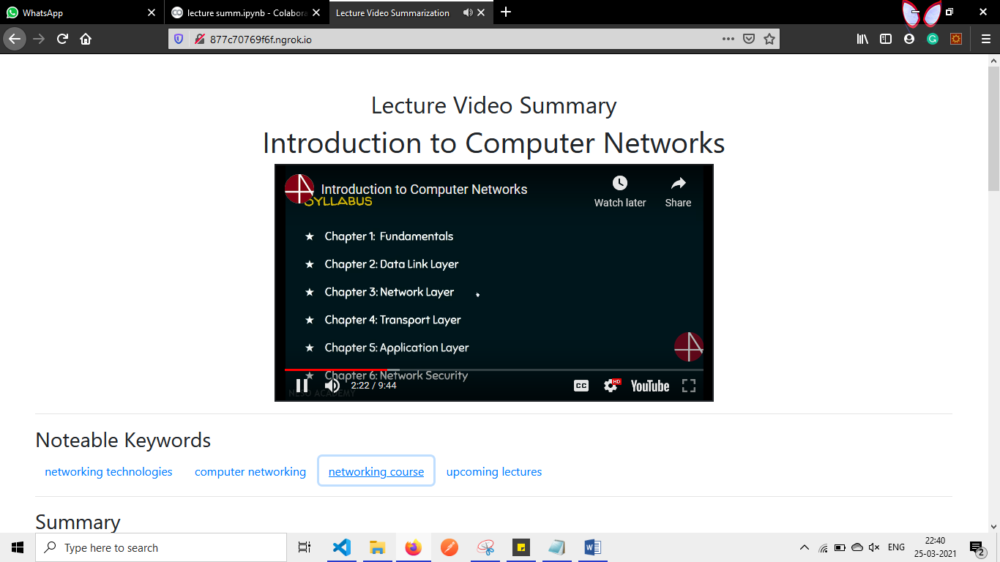

# Lecture-Video-Summarization
Watching videos for our own purposes to learn new things has become vital in 
our day to day lives to learn faster. However, to search according to our 
preferences mainly when searching lectures or short videos to learn concepts 
faster, it takes time to scour many videos to find appropriate to one user needs. 
To speed up the searching process, we are proposing a system to briefly 
summarise by implementing Lecture video summarization to summarize the 
contents said in a video and provide two line description, video accuracy, and a 
brief summary. By the information provided by our algorithm, it will be a quick 
way to search video. 

The proposed system is implemented by BERT summarizer algorithm to process large text information for extracting the 
necessary information and Maximum-Cosine-Value algorithm (our own 
algorithm) for producing cosine values to give rating for the video. These 
information will be a key factor to browse videos faster.

   

  

  

